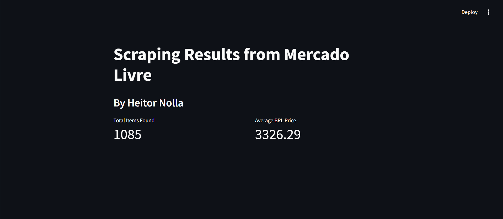

# mercadolivre-scraping

**Disclaimer:**
_This is a personal project intended for educational purposes only_

## Overview

This project leverages Python's **Scrapy** library to perform web scraping on Mercado Livre, specifically collecting information about **5-string bass guitars**

If you'd like to scrape data for a different item, just update the start_urls attribute located at:

```bash
extraction/spiders/mercadolivre.py
```

### Dashboard

The dashboard currently looks like this:



I will add more analysis to the dashboard as the project grows

## How to Install and Run the project

### With Docker

I have refactored the project to offer Docker support
Simply run

```bash
docker build -t mlscrape .
```

```bash
docker run -p 8501:8501 mlscrape
```

This will map your 8501 port to the one exposed on the Dockerfile
You will be able to access the dashboard by navigating to localhost:8501

### With a local Python installation

It is my personal recommendation that you make a new virtual Python environment for every project you run. To do so, open your preferred terminal and run the commands:

#### 1. Clone the repository

```bash
git clone https://github.com/heitornolla/mercadolivre-scraping.git
```

#### 2. Move to the project folder

```bash
cd mercadolivre-scraping
```

#### 3. Define the local Python version

```bash
pyenv local 3.12.1
```

#### 4. Create a new Python environment

You can do this with Venv with the command

```bash
python -m venv .venv
```

or use other environment managers, such as Conda

If you opted for Venv, activate the environment with

```bash
source .venv/Scripts/activate
```

#### 5. Install the Requirements

```bash
pip install -r requirements.txt
```

#### 6. Run the Project!

Run the crawl.py file to crawl Mercado Livre
To generate the dashboard based on your data, run

```bash
streamlit run dashboard/dashboard.py
```

## Technologies Used

Python 3.12.1

Scrapy for the Web Scraping

Pandas for Data Transformation

Streamlit for the dashboard

Docker for deploys
